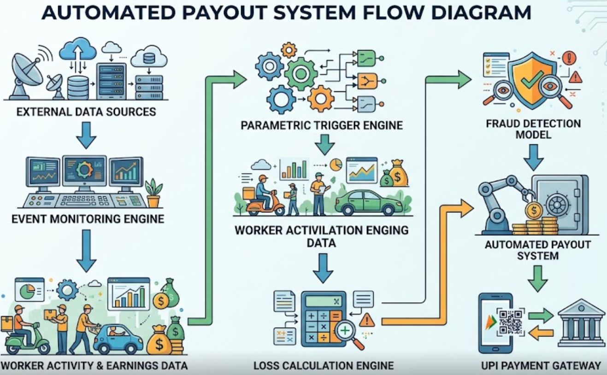

# AI-Powered Parametric Insurance for Gig Delivery Workers

## Overview

AI-Powered Parametric Insurance for Gig Delivery Workers is a technology platform designed to provide automated insurance protection for gig delivery workers. The system safeguards workers from income loss caused by external disruptions such as extreme weather, pollution spikes, strikes, or infrastructure failures.

The platform uses real-time external data sources, machine learning models, and automated payout mechanisms to detect disruptive events and compensate affected workers instantly without requiring manual claim submissions.

---

## Problem Statement

India’s rapidly growing gig economy includes millions of delivery workers who rely on daily earnings for their livelihood. However, most gig workers lack financial protection when unexpected disruptions occur.

Common disruptions affecting delivery operations include:

- Heavy rainfall and flooding  
- Extreme heat waves  
- Severe air pollution  
- Cyclones and severe storms  
- Government-imposed curfews or strikes  
- Traffic congestion or infrastructure shutdowns  

During these events, delivery demand drops significantly, leading to substantial income loss for workers.

Traditional insurance models are not suitable for gig workers because:

- Claims require manual documentation and verification  
- Payout processing can take weeks or months  
- Administrative processes introduce significant overhead  

As a result, gig workers remain financially vulnerable during unexpected disruptions.

---

## Proposed Solution

This project implements a **parametric insurance framework** specifically designed for gig economy workers.

Instead of requiring workers to submit insurance claims, payouts are automatically triggered when predefined external conditions exceed specific thresholds.

These triggers are based on objective data sources such as weather reports, pollution indexes, and government alerts.

### Example Trigger Conditions

| Event | Trigger Condition |
|------|-------------------|
| Heavy Rain | Rainfall greater than 150 mm within 24 hours |
| Extreme Heat | Temperature exceeding 42°C for two consecutive days |
| Severe Air Pollution | AQI greater than 400 |
| Cyclone | Wind speeds exceeding 90 km/h |
| Curfew / Lockdown | Official government emergency alert |
| Traffic Disruption | Severe city-wide congestion detected |

When a trigger condition occurs, the system performs the following steps:

1. Identifies delivery riders who were active in the affected area.
2. Calculates their expected income based on historical earnings.
3. Detects whether their income dropped significantly during the disruption.
4. Automatically issues a payout to eligible workers.

This approach removes the need for manual claim filing and enables instant financial assistance.

---

## Example Scenario

A delivery rider typically earns:

**Weekly Income:** ₹5400

During a severe flood week:

- **Actual Income:** ₹1200  
- **Income Loss:** ₹4200  
- **Coverage Plan:** 65%

The system automatically calculates the payout:

```
Payout = 65% × ₹4200
       = ₹2730
```

Total income after insurance compensation:

```
₹1200 + ₹2730 = ₹3930
```

The payout is transferred instantly using **UPI payment APIs**, providing immediate financial support to the worker.

---

## System Architecture

The following diagram illustrates the system architecture.




## Core Workflow

### 1. Enrollment

Delivery workers register through the mobile application and select their desired coverage level.

### 2. Premium Calculation

Each week the system calculates the premium based on:

- Location risk
- Selected coverage percentage
- AI-based risk score

### 3. Real-Time Monitoring

The backend continuously monitors external data sources including:

- Weather data
- Air quality indices
- Traffic disruptions
- Government alerts

### 4. Event Trigger Detection

When any monitored condition crosses predefined thresholds, the system registers a disruption event.

### 5. Affected Worker Identification

Delivery riders active in the affected region are automatically identified.

### 6. Loss Calculation

The system compares expected income (historical average) with actual earnings to determine financial loss.

### 7. Fraud Detection

Suspicious claims are detected using anomaly detection models.

### 8. Automatic Payout

Validated claims are processed and paid instantly using UPI payment systems.

---

## Insurance Model

### Expected Income

Expected weekly income is calculated using an **8-week moving average** of rider earnings.

### Coverage Plans

Workers can select from multiple coverage options:

- 40% coverage
- 50% coverage
- 65% coverage
- 70% coverage

### Premium Pricing

Premiums are dynamically calculated using the following risk-based model:

```
Premium = Base Rate × Zone Risk Score × Coverage Multiplier
```

Typical weekly premium ranges between:

**₹5 – ₹30 per week**

---

## AI / Machine Learning Components

### Risk Prediction Model

The risk prediction model determines the probability of disruption events to support dynamic pricing.

Algorithms used:

- LightGBM
- XGBoost

Input data includes:

- Weather forecasts
- Historical flood records
- Pollution trends
- Traffic patterns

Output:

```
Risk Score (0 – 1)
```

This score influences premium pricing.

---

### Fraud Detection Model

An **Isolation Forest anomaly detection model** identifies suspicious claims.

Potential fraud indicators include:

- GPS spoofing
- Claims from unrelated locations
- Single-user claims during large events
- No delivery activity during the disruption period

Flagged claims may be automatically rejected or manually reviewed.

---

### Worker Risk Score

Each rider receives an internal **insurance credit score** based on:

- Delivery activity patterns
- Claim history
- Fraud signals
- Platform engagement

This score slightly adjusts premium pricing and rewards reliable workers.

---

## Data Sources

The platform integrates multiple real-time data sources.

### Weather

- IMD weather data
- OpenWeatherMap APIs

### Air Quality

- CPCB AQI feeds
- World Air Quality Index

### Traffic

- Google Maps Traffic API

### Government Alerts

- Disaster management bulletins
- Police alerts
- Curfew notifications

### Platform Data

- Delivery earnings
- Rider online activity
- GPS location logs

---

## Technology Stack

### Mobile Application

- React Native (Expo)
- GPS tracking
- Push notifications
- Offline data synchronization

### Web Dashboard

- Next.js
- Administrative analytics
- Policy management
- Trigger monitoring

### Backend

- Node.js
- Express / NestJS
- REST APIs

### Databases

- PostgreSQL
- Redis

### Machine Learning Services

- Python
- FastAPI
- LightGBM
- Scikit-learn
- XGBoost

### Infrastructure

- Docker
- Cloud platforms (AWS / GCP / Azure)

### Payments

- Razorpay
- UPI payment integration

---

## Key Features

- Automated parametric insurance payouts
- Event-driven trigger mechanisms
- AI-powered dynamic premium pricing
- Real-time disruption monitoring
- Fraud detection using anomaly detection
- Mobile-first rider experience
- Instant UPI payout processing

---

## Development Roadmap

### Phase 1 – System Design

- Define disruption triggers
- Integrate weather and AQI APIs
- Design database schemas

### Phase 2 – Core Platform

- User registration system
- Policy management services
- Earnings data integration
- Weekly premium calculation

### Phase 3 – Trigger Engine

- Event monitoring pipeline
- Income loss calculation
- Automated payout system

### Phase 4 – AI Integration

- Risk scoring models
- Fraud detection systems
- Worker risk scoring mechanism

---

## Scalability

The system uses a **cloud-native microservices architecture** and is designed to scale across:

- Multiple cities
- Millions of gig workers
- Additional gig platforms such as ride-sharing and logistics

Horizontal scaling enables efficient onboarding of new users without major infrastructure changes.

---

## Impact

This platform strengthens financial resilience for gig workers by:

- Protecting income during disruptions
- Eliminating claim-processing friction
- Delivering instant payouts
- Providing affordable micro-insurance solutions

The system demonstrates how **AI, real-time data, and parametric insurance** can significantly improve social protection mechanisms for gig economy workers.
